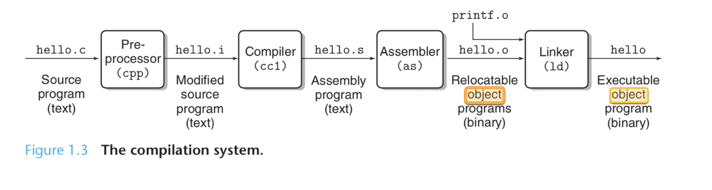

# Doing it slowly
[GRPC Medium Source](https://medium.com/@andrewvetovitz/grpc-c-introduction-45a66ca9461f)

## The Makefile

[Makefile Docs](https://opensource.com/article/18/8/what-how-makefile)

When we first call `make` only the first target in a makefile is the default target. This means that `all` is the only target that will be run.

This command triggers a cascade of other commands in the file. Let's follow the chain.

1. `make` triggers the call of the target `all`.
2. `all` triggers the call of `clean`, then `client`, then `server`.
3. `clean` runs `rm` and deletes old things.

```Makefile
client: hello.pb.o hello.grpc.pb.o hello_grpc_client.o
$(CXX) $^ $(LDFLAGS) -o $@

%.grpc.pb.cc: %.proto
protoc --grpc_out=. --plugin=protoc-gen-grpc=$(GRPC_CPP_PLUGIN_PATH) $<

%.pb.cc: %.proto
protoc --cpp_out=. $<

```
4. `client` is where things start to get interesting. The entities following the `:` are **prerequisites**. The prerequisites are: `hello.pb.o hello.grpc.pb.o hello_grpc_client.o`. When make is asked to evaluate a rule, it begins by finding the files indicated by the prerequisites and target. **If any of the prerequisites has an associated rule, make attempts to update those first**. 
    1. The first prerequisite to be evaluated is `hello.pb.o`. Makefile understands how to create object files, it needs to run `hello.pb.cc` through the compilation process.

    

    2. The only problem is that `hello.pb.cc` doesn't exist! Luckily another make target exists that matches any files that match `%.pb.cc`. The entity before the `:`in a Makefile is known as the **target**. A Makfile contains recipes for creating the target. Thus because the makefile wants to create the `hello.pb.cc` file, it starts executing the `%.pb.cc` target.
    3. This target's prerequisite is `%.proto`, which because we want to create `hello.pb.cc`, matches to `hello.proto`. Yay! Finally a file that exists in our directory!
    4. Finally, the makefile starts to execute the rules of the target. Note that the `$<` syntax substitutes the prerequisite into the command.
    ```bash
    protoc --cpp_out=. hello.proto
    ```
    5. The invocation of the proto compiler yields the target file: `hello.pb.cc`. Hooray! Of course, now we need to yield the actual prerequisite of the `client` which is `hello.pb.o`. 
    6. Once the `hello.pb.cc` file is created, the makefile knows how to create an object file from it, it uses the c++ compiler.
    ```bash
    g++ -std=c++11 -I/usr/local/opt/openssl/include `pkg-config --cflags protobuf grpc`  -c -o hello.pb.o hello.pb.cc
    ```
    7. This yields the prerequisite for `client`, `hello.pb.o`. 
    8. From here the Makefile moves onto the next prerequisites, `hello.grpc.pb.o hello_grpc_client.o`, which follow a similar pattern. I won't walk through every step, but you should trace through the following output of the Makefile to make sure you understand what is happening. 
    ```bash
    protoc --grpc_out=. --plugin=protoc-gen-grpc=`which grpc_cpp_plugin` hello.proto
    g++ -std=c++11 -I/usr/local/opt/openssl/include `pkg-config --cflags protobuf grpc`  -c -o hello.grpc.pb.o hello.grpc.pb.cc
    g++ -std=c++11 -I/usr/local/opt/openssl/include `pkg-config --cflags protobuf grpc`  -c -o hello_grpc_client.o hello_grpc_client.cc
    g++ hello.pb.o hello.grpc.pb.o hello_grpc_client.o -L/usr/local/lib `pkg-config --libs protobuf grpc++` -o client
    rm hello.grpc.pb.cc hello.pb.cc
    ```
    9. Lastly, the Makefile will delete all the intermediary files generated through the compilation process. If you want to leave these files, you need to use the `PRECIOUS` directive.
5. The `server` command follows the same pattern as the client. 